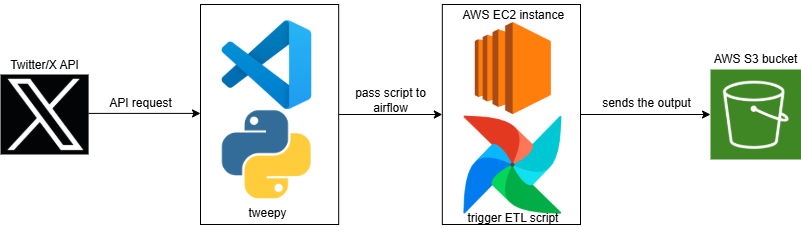

# X-Twitter-ETL-2025
The X-Twitter ETL 2025 is a 2025 version of [Darshil Parmar](https://www.linkedin.com/in/darshil-parmar/)'s [Twitter Data Pipeline using Airflow for Beginners | Data Engineering Project](https://www.youtube.com/watch?v=q8q3OFFfY6c). This project extracts, transforms, and loads data from Twitter using the Tweepy module in Python. The Python script is orchestrated by Apache Airflow, which runs on an AWS EC2 instance. Airflow schedules and executes the script to fetch tweets, process them if needed, and store the resulting data in an AWS S3 bucket.

## Description
1. **Extraction** - This pipeline uses the Tweepy module in python to fetch tweets in X(Twitter). I set the extract count per run to only 10 since the maximum tweets that can be extracted is 100 for a free tier account in X developer.
2. **Transform** - The extracted data was then transformed in Python using Pandas module to create a datafram.
3. **Load** - The transformed data or the output csv file is loaded to AWS S3 bucket.
